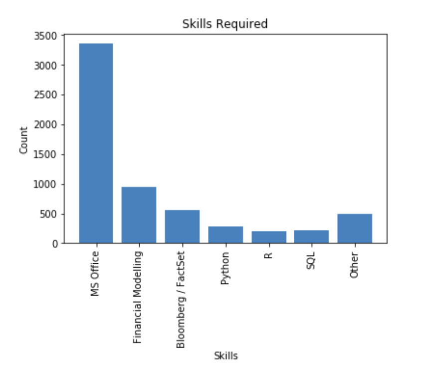

# LSE CAREER HUBBER

### DS105M Project

## Executive Summary:

This project aims to shed light on the investment banking hiring landscape by analysing data on the LSE official vacancy board - LSE Career Hub. Using the insights obtained from the data analysis, we seek to help students better understand the demand and hiring preferences of investment banks, and how they can become more competitive candidates; also, we offer suggestions on potential areas LSE Career Hub can improve on to better facilitate students’ job hunting process. We decided to do this project as LSE students have a huge desire to work in the financial industry with 20.9% of LSE graduates working in the sector (data from 2017-20 graduates). In particular, investment banking roles are the most sought-after because of its lucrative nature and the exit opportunities for different careers. With the advent of technology, companies’ hiring process is mostly online nowadays. Thus, as the official vacancy board of LSE, the LSE Career Hub should contain a lot of useful data for understanding the investment banking hiring scene.

For the data, we collected 6623 job postings under the “Investment Banking” employer industry classification on LSE CareerHub from the inception of the vacancy board (2012) to 2023. There are 7 variables in the data: 1. Job Title, 2. Job location, 3. Job details, 4. Job application deadline, 5. Job commencement, 6. Job links, 7. Company hiring for the job. We have mainly used the package Selenium and BeautifulSoup to scrap our data.

We have two main objectives. For our primary objective, which is to analyse the investment banking hiring landscape for LSE students to become more competitive, we divided our analysis into 4 main sections: 1. Desired Skill Sets, 2. Firms’ Hiring Appetite & Recruitment Season Patterns, 3. Opportunity/Contract Type, and 4. Top Firms that Post on LSE Career Hub. We have mainly used Numpy, Pandas, matplotlib, and plotnine to clean and wrangle the data, but for section 1 (Desired Skillset), we also made use of the spaCy package for natural language processing and fuzzywuzzy for string matching to analyse unstructured texts. Though we initially intended to include the geography and location aspect of these jobs in our analysis, the knowledge and expertise in geopandas and geopy required was far beyond our own, and therefore the geography analysis was omitted. 

Because the 4 different sections are focusing on aspects of the job posting that are quite different, we will need different types of visualization to extract meaningful information and identify the patterns we want. As different types of visualisation require different types of data, the data cleaning and data wrangling part has been divided into different parts for a more organized and cleaner manipulation of data. 

For our secondary objective, which is to suggest aspects LSE CareerHub can improve upon based on the obstacles we encountered during our data collection and cleaning process. The two suggestions are 1. Desired skills should be selected from a predefined list for a standardized approach and easier search process for students 2. The job description should be structured in a clear and organised manner by dividing it into distinct parts (e.g. "who we are" and "what we are looking for") allowing for quick access to information.

Potential ideas for further developing this research are 1. Unable to create Choropleth Map due to limited knowledge of geopandas and geopy. A successful map could be created to show job posting distribution by country and help LSE expand opportunities for students, 2. Desired Soft Skills Analysis: Currently analyzing hard skills, with potential to expand to include soft skills such as leadership and communication skills using further Natural Language Processing (NLP) techniques, 3. Relationships between Datasets: Potential to explore the relationship between datasets such as skills desired and contract types, to gain further insights into investment banking firms' hiring practices, 4. Generalizability: Our analysis framework can be applied to other industries to study their hiring landscapes and inform job seekers.

## Motivation/Justification:

In this digital era, it is way easier for employers to receive and manage job applications through online platforms. Therefore, many employers have switched from traditional paper-based job applications to online ones, thereby increasing the speed and efficiency of the application process. Also, in the past, job seekers used to rely on classified ads in newspapers or word-of-mouth to learn about job opportunities. Whereas technology nowadays has greatly expanded the amount of information available to job seekers, making it easier for them to research potential employers and specific details regarding the roles open for hire. 

With more information readily available, applicants can research more thoroughly, allowing them to tailor their applications and prepare more effectively for interviews. However, this greater access to information is a double-edged sword. Although there is more information available, applicants may struggle to determine which information is the most relevant. Furthermore, not all of the information available online may be accurate or up-to-date, thus applicants are also susceptible to the risk of misinformation. Given the strong demand of LSE students to enter the financial industry with 20.9% of LSE graduates working in the sector (data from 2017-20 graduates). In particular, investment banking roles are the most sought-after because of its lucrative nature and the exit opportunities to different careers. We believe it would be beneficial to assist LSE students in navigating through the foggy investment banking job market sea, and bring clarity to them. 

We bring clarity to students by helping them gain a better understanding of the hiring demand/preferences of employers and the macro landscape of the investment banking job market. In terms of hiring demand/preferences of employers, one example is that we investigated what the desired skills are in the job descriptions through analyzing the frequency of their occurrences across the 6000+ job postings. Therefore, by understanding the specific skills, experiences, and qualities that financial industry employers are seeking, job seekers can tailor their work experiences, resumes, and interview responses to better align with these preferences. This can increase the chances of being selected for an interview and ultimately landing a job. In terms of the macro landscape of the investment banking job market, one example is that we sliced the application deadline data into each year and examined the patterns to determine the peak seasons of applications and whether these seasons are consistent across the years. Thus, applicants can determine the best times to apply for jobs and maximise their chances of success. All in all, our ultimate goal is to help LSE students position themselves as strong candidates in the competitive investment banking job market.

In addition, we seek to offer suggestions on how LSE CareerHub can improve to enhance the functionality of the official LSE vacancy board. We discover potential improvements by identifying the roots of some of the problems we encountered during the data collection and cleaning process. For example, we had difficulties extracting desired skills from the unstructured text data in the job description, thus it would be ideal for the portal to add a section for desired skills where employers select from a list of skills when posting a job and students can filter roles based on desired skills, resulting in a more standardized approach and easier search process.

## Aim/Objective:

The purpose of this project is twofold: first, the primary objective is to analyze the investment banking hiring landscape, subsequently informing LSE students on how to become more competitive candidates, whereas the secondary objective is to proffer insights into ways in which LSE CareerHub can be optimized to aid students in their job search. 

# - Primary Objective

To achieve the primary objective, we hope to offer insights on several areas related to the hiring demand/preferences of employers and the macro landscape of the investment banking job market: 1. Desired Skill Sets, 2. Firms’ Hiring Appetite & Recruitment Season Patterns, 3. Opportunity/Contract Type, and 4. Top Firms that Post on LSE Career Hub.

Therefore, the key questions we aim to answer in order to achieve our primary objective are:

1. What are the desired skill sets for an investment banking role?
2. Has firms' hiring appetite changed over the years and if so, what factors might have driven these changes?
3. What is the timeline and pattern of recruitment seasons, and has it changed throughout the years?
4. What are firms’ hiring tendencies in terms of opportunity/contract types?
5. What are the top firms that post on LSE CareerHub?
6. How can we use answers to the aforementioned questions to uplift the competitiveness of LSE students in the investment banking industry? 

# - Secondary Objective

The secondary objective stems from identifying the obstacles we had during the data collection and cleaning process, which constitutes a key question:

7. How can we improve the functionality and usability of the LSE CareerHub, given the difficulties we faced during the data collection and cleaning process?

## Data Visualisation and Interpretation:

After we completed collecting, cleaning and wrangling the data, we visualised and interpreted the data to answer the key questions we set out above. 

# 1. Desired Skill Sets

We seek to answer the crucial question: “What are the desired skill sets for an investment banking role?”

