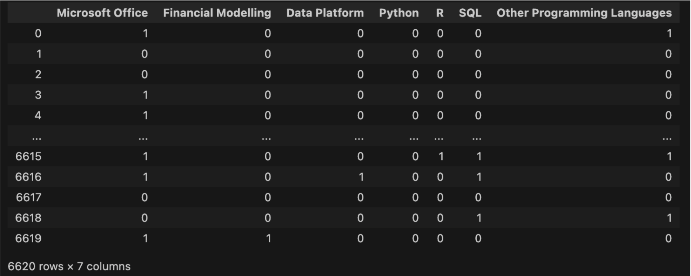
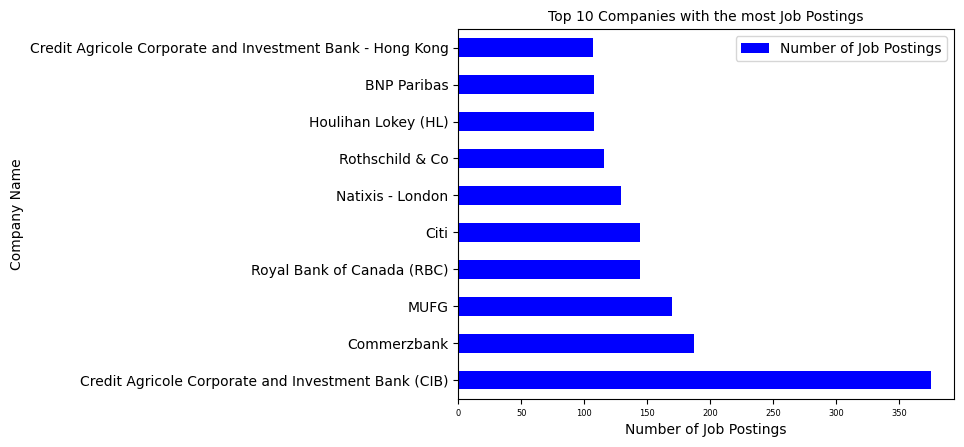

# LSE CAREER HUBBER

### DS105M Project

## Executive Summary:

This project aims to shed light on the investment banking hiring landscape by analysing data on the LSE official vacancy board - LSE Career Hub. Using the insights obtained from the data analysis, we seek to help students better understand the demand and hiring preferences of investment banks, and how they can become more competitive candidates; also, we offer suggestions on potential areas LSE Career Hub can improve on to better facilitate students’ job hunting process. We decided to do this project as LSE students have a huge desire to work in the financial industry with 20.9% of LSE graduates working in the sector (data from 2017-20 graduates). In particular, investment banking roles are the most sought-after because of its lucrative nature and the exit opportunities for different careers. With the advent of technology, companies’ hiring process is mostly online nowadays. Thus, as the official vacancy board of LSE, the LSE Career Hub should contain a lot of useful data for understanding the investment banking hiring scene.

For the data, we collected 6623 job postings under the “Investment Banking” employer industry classification on LSE CareerHub from the inception of the vacancy board (2012) to 2023. There are 7 variables in the data: 1. Job Title, 2. Job location, 3. Job details, 4. Job application deadline, 5. Job commencement, 6. Job links, 7. Company hiring for the job. We have mainly used the package Selenium and BeautifulSoup to scrap our data.

We have two main objectives. For our primary objective, which is to analyse the investment banking hiring landscape for LSE students to become more competitive, we divided our analysis into 4 main sections: 1. Desired Skill Sets, 2. Firms’ Hiring Appetite & Recruitment Season Patterns, 3. Opportunity/Contract Type, and 4. Top Firms that Post on LSE Career Hub. We have mainly used Numpy, Pandas, matplotlib, and plotnine to clean and wrangle the data, but for section 1 (Desired Skillset), we also made use of the spaCy package for natural language processing and fuzzywuzzy for string matching to analyse unstructured texts. Though we initially intended to include the geography and location aspect of these jobs in our analysis, the knowledge and expertise in geopandas and geopy required was far beyond our own, and therefore the geography analysis was omitted. 

Because the 4 different sections are focusing on aspects of the job posting that are quite different, we will need different types of visualization to extract meaningful information and identify the patterns we want. As different types of visualisation require different types of data, the data cleaning and data wrangling part has been divided into different parts for a more organized and cleaner manipulation of data. 

For our secondary objective, which is to suggest aspects LSE CareerHub can improve upon based on the obstacles we encountered during our data collection and cleaning process. The two suggestions are 1. Desired skills should be selected from a predefined list for a standardized approach and easier search process for students 2. The job description should be structured in a clear and organised manner by dividing it into distinct parts (e.g. "who we are" and "what we are looking for") allowing for quick access to information.

Potential ideas for further developing this research are 1. Unable to create Choropleth Map due to limited knowledge of geopandas and geopy. A successful map could be created to show job posting distribution by country and help LSE expand opportunities for students, 2. Desired Soft Skills Analysis: Currently analyzing hard skills, with potential to expand to include soft skills such as leadership and communication skills using further Natural Language Processing (NLP) techniques, 3. Relationships between Datasets: Potential to explore the relationship between datasets such as skills desired and contract types, to gain further insights into investment banking firms' hiring practices, 4. Generalizability: Our analysis framework can be applied to other industries to study their hiring landscapes and inform job seekers.

## Motivation/Justification:

In this digital era, it is way easier for employers to receive and manage job applications through online platforms. Therefore, many employers have switched from traditional paper-based job applications to online ones, thereby increasing the speed and efficiency of the application process. Also, in the past, job seekers used to rely on classified ads in newspapers or word-of-mouth to learn about job opportunities. Whereas technology nowadays has greatly expanded the amount of information available to job seekers, making it easier for them to research potential employers and specific details regarding the roles open for hire. 

With more information readily available, applicants can research more thoroughly, allowing them to tailor their applications and prepare more effectively for interviews. However, this greater access to information is a double-edged sword. Although there is more information available, applicants may struggle to determine which information is the most relevant. Furthermore, not all of the information available online may be accurate or up-to-date, thus applicants are also susceptible to the risk of misinformation. Given the strong demand of LSE students to enter the financial industry with 20.9% of LSE graduates working in the sector (data from 2017-20 graduates). In particular, investment banking roles are the most sought-after because of its lucrative nature and the exit opportunities to different careers. We believe it would be beneficial to assist LSE students in navigating through the foggy investment banking job market sea, and bring clarity to them. 

We bring clarity to students by helping them gain a better understanding of the hiring demand/preferences of employers and the macro landscape of the investment banking job market. In terms of hiring demand/preferences of employers, one example is that we investigated what the desired skills are in the job descriptions through analyzing the frequency of their occurrences across the 6000+ job postings. Therefore, by understanding the specific skills, experiences, and qualities that financial industry employers are seeking, job seekers can tailor their work experiences, resumes, and interview responses to better align with these preferences. This can increase the chances of being selected for an interview and ultimately landing a job. In terms of the macro landscape of the investment banking job market, one example is that we sliced the application deadline data into each year and examined the patterns to determine the peak seasons of applications and whether these seasons are consistent across the years. Thus, applicants can determine the best times to apply for jobs and maximise their chances of success. All in all, our ultimate goal is to help LSE students position themselves as strong candidates in the competitive investment banking job market.

In addition, we seek to offer suggestions on how LSE CareerHub can improve to enhance the functionality of the official LSE vacancy board. We discover potential improvements by identifying the roots of some of the problems we encountered during the data collection and cleaning process. For example, we had difficulties extracting desired skills from the unstructured text data in the job description, thus it would be ideal for the portal to add a section for desired skills where employers select from a list of skills when posting a job and students can filter roles based on desired skills, resulting in a more standardized approach and easier search process.

## Aim/Objective:

The purpose of this project is twofold: first, the primary objective is to analyze the investment banking hiring landscape, subsequently informing LSE students on how to become more competitive candidates, whereas the secondary objective is to proffer insights into ways in which LSE CareerHub can be optimized to aid students in their job search. 

### - Primary Objective

To achieve the primary objective, we hope to offer insights on several areas related to the hiring demand/preferences of employers and the macro landscape of the investment banking job market: 1. Desired Skill Sets, 2. Firms’ Hiring Appetite & Recruitment Season Patterns, 3. Opportunity/Contract Type, and 4. Top Firms that Post on LSE Career Hub.

Therefore, the key questions we aim to answer in order to achieve our primary objective are:

1. What are the desired skill sets for an investment banking role?
2. Has firms' hiring appetite changed over the years and if so, what factors might have driven these changes?
3. What is the timeline and pattern of recruitment seasons, and has it changed throughout the years?
4. What are firms’ hiring tendencies in terms of opportunity/contract types?
5. What are the top firms that post on LSE CareerHub?
6. How can we use answers to the aforementioned questions to uplift the competitiveness of LSE students in the investment banking industry? 

### - Secondary Objective

The secondary objective stems from identifying the obstacles we had during the data collection and cleaning process, which constitutes a key question:

7. How can we improve the functionality and usability of the LSE CareerHub, given the difficulties we faced during the data collection and cleaning process?

## Data Collection:
### 1. Data Source

The primary source of data for this project was extracted from the LSE Career Hub website which is an internal job portal for LSE students. Here is an example webpage for a particular job posting that is of interest to the project. 

To offer the most insight to the students, we took all of the available data from the last 10 years (2012-2022). 

The information available is quite comprehensive but our data collection the following pieces of information for a given job:

- the job title
- the job location
- the job details
- the job application deadline
- the job commencement 
- the company hiring for the job
- the job links

### 2. Data Collection

were requests, selenium, BeautifulSoup, and Pandas.

The first obstacle to collecting the data was entering the university’s internal website. As the portal grants exclusive access to LSE students, valid login details need to be used to access the data. By inputting our member’s credentials using the selenium library, we were able to enter the website. 

Selenium allows for the navigation of websites through its .click() function which clicks on the target location which is specified by the CSS path. The CSS path is found by inspecting the website. After applying the investment banking industry filter, including expired jobs, and selecting to view all relevant jobs, the resulting webpage was a page with links to 6623 jobs.

Using the first for loop, with BeautifulSoup we scan the entire list and extract the link, job title, and application deadline for each job. The remaining information was extracted by going into each job’s webpage (with a second loop) and identifying the relevant HTML block; these included commencement date, job details (which include skills required, responsibilities of the job, etc.), contract type, and opportunity type.  

An obstacle in this part of the data collection was the varied structures of the webpage. Depending on how old the job posting was, certain pieces of information were located in different parts of the HTML blocks. The second loop would stop when the block it was looking for did not exist or was located in another branch of HTML.
Through a combination of trial-and-error and manually looking at the HTML code of web pages that raised errors, the loop was able to adjust its search across varied structures of web pages using different error exceptions. 

Every piece of information was appended to its corresponding list (e.g. each job title was contained in a list called job_titles). The lists were converted to Pandas and finally exported as a .csv file. 

One note on our final dataset is that although initially, we planned to conduct analysis using the commencement date, the objective of our project shifted so that data was no longer utilized. Additionally, due to some errors in the collection, “remuneration” was collected in place of “commencement date” for certain jobs.

Lastly, links were collected in order to easily navigate to the jobs if we wanted to access the webpage directly. This was useful for referencing and making sure our extraction process matched with the actual webpage content.

### 3. Challenges

To summarize the challenges we faced, we first had to use selenium with actual credentials to overcome the access barrier to the LSE Career Hub. Upon navigating to the filtered web page with the entire list of jobs, the next challenge was developing an algorithm that would extract every piece of information across thousands of web pages that varied in their structure; this was achieved by adding exceptions in the for-loop to address the various errors. A final challenge overall was the sheer volume of data which required time to wait for the algorithm to run and stop an error. It was difficult to preemptively account for the errors since it was not feasible to predict which exact dates the webpages’ structures changed, so it took waiting to run into the errors to fix them. 

### 4. Exploratory Data Analysis (EDA)

The data includes 6623 individual jobs with 11 columns each. The relevant variables/columns for the final analysis are the following:
1. Title of the job which is treated as categorical data.
2. Details of the job
3. The deadline for the application is interval data.
4. Job opportunity type (internship, graduate, etc.) which is a categorical data type.
5. Contract Type (Temporary, Part-time, etc) which is categorical data.
6. .Location (London, Hong Kong, etc.) which is categorical data.
7. Company Name (Rothschild & Co., BNP Paribas, etc.) is treated as categorical data.

The distributions of some of these variables are produced in the data visualisations.

## Methodology (Data Cleaning, Wrangling, and Visualization):

We predominantly used Python and Jupyter Notebook to filter, merge, reshape and pivot our data. We removed rows with missing data, and standardized the data we wanted, so that when we slice the data frame for analysing a specific aspect of the job postings, the data is clean and easy to manipulate. The Pandas library is especially useful as we have to deal with large amounts of data, and therefore converting it into a ndarry series first makes the program much more efficient. After cleaning and wrangling with the data, we mainly made use of matplotlib, and plotnine to create visualisations for the data. Because the way we have to clean and wrangled with each dataset to produce each of the visualisations is quite different, we will be outlining the condensed steps individually below:

### (Skills Required)

To extract the distributions of skills required from all of the jobs, our program stores the values from the ‘details’ column in a new dataframe. This is done with basic data wrangling using Pandas. This dataframe contains texts of varying structures, sizes, and values. The unstructured nature of the text data–which was one of the biggest hurdles/limitations we faced–required the use of natural language processing. 

The process for producing the distribution visualisation of skills was composed of multiple steps and required various libraries: pandas, spacy, fuzzywuzzy, pickle, and matplotlib. 

The first step was to convert every text entry into a spacy object called a ‘document.’ This object possesses many useful attributes including determining the parts of speech of a given word. Using this feature, we looked at our list of keywords and tested what part-of-speech spacy identified our skills as and we decided to keep words that were either proper-nouns or nouns. The rationale for including this initial filter is to reduce the size of the data that the next filter would need to process and thereby reduce the computation costs.

The next filter—which we refer to as the dictionary filter—utilizes the string matching library called fuzzwuzzy. 

We need to create a few objects before running the filter against the dataset. 

1. We create a list of keywords that correspond to each respective skill. Some skills appear in a variety of ways so we include its most occurring form.

- for example, when looking for Microsoft Office Skills, we may search for the following keywords in the text: ["Microsoft","MS","MS-Office","Powerpoint","Excel"]

2.  We create an empty dataframe using Pandas called df_bool which will store the occurrence of every skill for every respective job.  

Next, we create a function called dict_filter_bool which appends entries of 0 or 1 to the df_bool.

The dictionary contains multiple layers:
1. The individual inner component object (‘MS’, ‘PY’, etc. in the code) extracts tokens (similar to strings) from the inputted text that match with the list of skills we are looking for and also passes a specified matching score threshold.
2. If there is at least one match (indicating that our skill was found somewhere in the text), we get a boolean value of True, which is then converted to a numerical value (1 for True, 0 for False). 
3. The final result is a binary value indicating whether the skill was found in the text.
4. This process is repeated for each skill.
5. The final line of code in the dictionary filter function appends to the df_bool the corresponding entries of 0s and 1s for each skill for that particular text. 

The inner function looks like this: 

The filter has several parameters:

- the token score type
- the token score threshold
- the list of skills included in the dictionary for each respective skill

These parameters can be fine-tuned further, but with preliminary trial-and-error testing, we decided on the specific words to include, score type and score threshold.

The function is then applied to the entire dataset. In order to apply the dictionary filter function to every text data, the filtered documents (with irrelevant part-of-speech removed) were converted into a series using Pandas. The function was then applied to the series. 

The final result of the dictionary filter is a dataframe (the final df_bool) with the skills as the column names and binary inputs as the values indicating it was required by the job.

Once the data frame was created, the column values were added to count how often a skill was referenced in all of the jobs. This data was used to create a graph to show the distribution of the skills.  

### (Application Deadline)

To analyze the application deadline data, we will first extract the relevant column from the dataset using the pandas DataFrame method .iloc.

In order to maintain the integrity of the original dataset, we will create a copy of the data using the df_deadlines.copy() function.

#### Graphs Part 1: Deadline Frequency of each year by date

To visualize the frequency of deadlines over time, we will use the groupby method and the .dt.floor('d') function to count the number of occurrences of each date and standardize the format of the DateTime data.

By modifying the code to change the df.floor('d') function to dt.month, we can plot a time series of the deadlines for each year, broken down by month.

#### Graphs Part 2: Deadline frequency of each year (by year)

We will use the groupby method in conjunction with the .dt.year function to calculate the frequency of deadlines for each year.

To make this information more accessible, we will create a dictionary that maps each year to the corresponding number of deadlines per year, allowing us to plot a time series that shows the annual distribution of deadlines.

#### Graphs Part 3: Deadline Frequency of each month for each year in separate graphs

To further break down the data, we will use a for loop to iterate through the group.groupby method, combined with the .dt.to_period('m') function, to plot a time series for each year, separated by month.

### (Opportunity and Contract Types)

To analyze the opportunity and contract types in the data, we will extract the relevant columns using the .iloc method.

The data has already been standardized, so we do not need to perform additional cleaning.

To identify the different types of job opportunities, we will filter the data to create two new series for permanent and temporary opportunities and use the .value_counts() method to determine the frequency of each job type.

For the permanent opportunity type, we will create two new series to store the frequency count of graduate employment and experienced hire contract types.

For the temporary opportunity type, we will create two new series to store the frequency count of internship and part-time contract types.

Finally, we will plot a stacked bar graph to show the distribution of the four new series, providing a visual representation of the mix of contract types for each opportunity type.

### (Firms)

To analyze the distribution of job postings across different firms, we will extract the opportunity and contract type columns using the .iloc method.

We will use the .value_counts method to calculate the frequency of job postings for each company.

To make the information more manageable, we will select the top 10 companies with the highest frequency of job postings and use this information to further analyze the hiring landscape in the investment banking sector.

## Data Visualisation and Interpretation:

After we completed collecting, cleaning and wrangling the data, we visualised and interpreted the data to answer the key questions we set out above. 

### 1. Desired Skill Sets

We seek to answer the crucial question: “What are the desired skill sets for an investment banking role?”

The frequency plot of the desired skill sets for investment banking positions is an insightful representation of the key competencies sought after by employers in this industry. The x-axis consists of the different skills that were mentioned in the job descriptions, and the height of each bar represents the frequency of the skill mentioned. It provides valuable insights into the most in-demand skills for investment banking roles.

The result shows that Microsoft Office skills are the most in-demand with nearly 3400 appearances, which is a significant margin over the second most frequently appearing skill, Financial Modelling, with around 1000 appearances. It is evident that Microsoft Office skills are highly valued, as they are essential for day-to-day tasks in the industry. For example, proficiency in Excel and PowerPoint is crucial in investment banking as these tools are used extensively for financial analysis and presentations. Additionally, the high demand for financial modelling skills highlights the importance of financial analysis in investment banking. Investment banking requires the ability to analyze and interpret financial data, which is a critical aspect of the job. Financial modelling skills allow investment bankers to create and interpret financial models, enabling them to make informed decisions.

The appearance of Bloomberg/Factset skills in third place, followed by programming skills like Python, R, and SQL, suggests that investment banks also place value on proficiency in industry-specific data platforms and technology. The ability to utilize these data platforms and technologies effectively can provide a competitive advantage for candidates seeking to enter the investment banking industry. Being able to navigate around data platforms such as Bloomberg and FactSet is an important skill as investment banks rely heavily on data to make informed decisions. Additionally, knowledge of programming languages such as Python and R can aid investment bankers in automating repetitive tasks, making data analysis more efficient, and conducting advanced financial modelling.

Therefore, using the insight of the data, students can tailor their education, training, and experience to align with the requirements of the industry. This can increase their competitiveness and improve their chances of securing a job in investment banking.

For example, the high demand of Microsoft Office skills highlights the importance of proficiency in these programs in investment banking roles. Students can develop their skills in these programs and add them to their resumes to demonstrate their proficiency. The second most appeared skill, financial modelling, also indicates the importance of having financial analysis skills, which students can develop through courses, projects, and internships.

Also, the plot can give students an idea of what types of tasks and responsibilities they will likely be expected to perform in investment banking roles. Students can be prepared to discuss their experiences in these areas and how they can apply these skills to the job.

In conclusion, the frequency plot provides useful insight into the desired skill sets for investment banking roles, which students can use to inform their career development and job search strategies. By aligning their skills with the industry requirements, students can increase their chances of securing a job in investment banking and advancing their careers in the industry.

### 2. Firms’ Hiring Appetite and Recruitment Season Patterns

In this section, we focus on answering the following two questions by analysing the application deadlines for job postings:

- Has firms' hiring appetite changed over the years and if so, what factors might have driven these changes?
- What is the timeline and pattern of recruitment seasons, and has it changed throughout the years?

#### 2.1 Firms’ Hiring Appetite

This sub-section focuses on answering the first question: Has firms' hiring appetite changed over the years and if so, what factors might have driven these changes? 

To answer the question, we constructed a time-series graph. The y-axis represents the frequency count of application deadlines of a specific year and the x-axis depicts the year. This visualization provides us with a comprehensive view of how the frequency of application deadlines, serving as a proxy for the firms' hiring appetite in investment banking, has evolved over the past ten years.

The graph displays notable variations in the frequency count of application deadlines. A low-frequency count is observed prior to 2013, which may be attributed to the recent establishment of the job portal in 2012, resulting in limited awareness of the platform among employers.

The frequency count of application deadlines for investment banking roles displayed an upward trend leading up to 2018, culminating in a peak in that year, indicative of a growing demand for hires. The hiring demand of investment banks is often impacted by the state of the economy, as investment banking services, such as underwriting, mergers and acquisitions, and trading, are tied to the health of the economy. Economic expansions, marked by high growth and corporate profits, resulted in increased demand for investment banking services and hence hiring demand. Conversely, during economic contractions or recessions, characterized by slow growth and declining corporate profits, demand for investment banking services typically decreases, causing fluctuations in revenue, profits, overall performance, and hiring demand.

Analysis of the state of the UK economy during the years 2016 to 2018 showed a declining unemployment rate and a steady GDP growth rate. The unemployment rate in 2016, 4.9%, decreased to 4.3% in 2017 and 4.2% in 2018, according to the Office for National Statistics (ONS), compared to 7.6% in 2012. The GDP growth rate also displayed steady growth, with a rate of 1.8% in 2016, increasing to 1.9% in 2017 and 1.4% in 2018. The global economy, as per World Bank data, grew by 3.1% in 2017 and 3.0% in 2018, suggesting favourable economic conditions globally as well. These factors point to the availability of more investment banking job opportunities, which could explain the observed increase in the frequency count of application deadlines.

The frequency count of application deadlines experienced a significant drop post-2020, likely due to the impact of the Covid-19 pandemic on the global and UK economies. According to World Bank data, the global unemployment rate increased from 5.6% in 2019 to 6.5% in 2020, while the global GDP contracted by 4.3% in 2020, reflecting widespread job losses and economic slowdown.

In the UK, the labour market was significantly impacted, with the unemployment rate rising from 3.9% in Feb 2020 to 5.0% in Dec 2020 and the economy contracting by 9.9% in 2020, the largest annual fall on record. This combination of rising unemployment and economic contraction likely impacted the frequency count of application deadlines. Investment banks facing economic uncertainty and reduced demand for their services reduced their hiring activities.

The lower frequency count of 2021 compared to 2020, although counter-intuitive, can be explained by time lags. Jobs with application deadlines in 2020 were posted early in the year, prior to the realization of the long-term impact of Covid. Once the longevity of the pandemic became apparent in the second half of 2020, employers adjusted their hiring decisions, reducing demand for labour in 2021 and leading to a decrease in hiring activities.

Lastly, we see a slight improvement in 2022 compared to 2020/21, which suggests that the investment banking job market is slowly recovering from the pandemic. 

To summarize, the frequency of application deadlines for investment banking roles exhibits cyclicality and is sensitive to the state of the economy. Economic prosperity and expansion typically correspond to higher hiring demand, while economic downturns and contractions correspond to lower hiring demand. Examining economic conditions and trends can provide insight into the competitiveness of the job market and inform students' predictions about future hiring demand. Economic forecast data can also be used to gauge the selectiveness of the recruitment process. For instance, in the event of a predicted economic decline, students can expect a more selective hiring process as firms may reduce headcount.

#### 2.2 Firms’ Recruitment Season Patterns

In order to gauge whether there is a seasonal trend in hiring and answer the second sub-question in this section: “what is the timeline and pattern of recruitment seasons, and has it changed throughout the years?”, we sliced the data and created 12 monthly time-series graphs of application deadline frequency, with the number of deadlines on the y-axis and the months of each year on the x-axis. Additionally, to provide a comprehensive perspective on the overall seasonal trend over 12 years, we included a graph showing the cumulative frequency count of application deadlines per month between 2012 and 2023.

The years 2012 and 2023 were not representative due to the launch of the job portal in 2012 and incomplete data in 2023 (we collected the data in December 2022). Excluding these years, we observed a consistent peak in October and November. This can be attributed to the fact that LSE CareerHub is a university job portal and a large portion of the job postings are internships (we would provide further evidence for this in the Opportunity/Contract Type section). As most investment banks’ internship programs take place in summer, during which university students can work in the capacity of full-time employees, and that summer internship deadlines for a given year are often in October/November in the preceding year, thus the peak aligns with the recruitment process for summer internships at investment banks.

We also noticed smaller peaks in February/March and June/July. These peaks are smaller compared to that of October/November as the jobs with deadlines in these months are likely to be off-cycle internships (for students taking a gap year who can work during non-summer periods) or graduate employment, for which firms would not hire as many people as they do during summer internships. The primary source of hires for investment banking entry roles is through summer internships, where interns have the opportunity to demonstrate their abilities and potentially secure full-time employment. Off-cycle internships and graduate employment are often utilized by banks as alternative means to fill vacancies when summer interns decline return offers or when changes in business requirements occur.

The existence of smaller peaks in hiring data might suggest a recurring pattern, with firms making new hires at roughly three or four-month intervals. This correlation may be tied to the end of fiscal quarters, which each have a duration of three months and culminate in a year. Investment banks often coordinate their hiring with the end of fiscal quarters as a strategy to balance business demands with cost management. At the end of each quarter, banks may assess their financial performance, market outlook, and staffing needs, and adjust their hiring practices accordingly. A positive financial outlook and expanding business opportunities may prompt increased recruitment efforts, whereas financial challenges may result in a reduction of hiring to control expenses. By tying their hiring to the end of fiscal quarters, investment banks can align staffing with business needs while also exercising cost management.

Having a thorough understanding of seasonal hiring patterns can benefit students by enabling them to plan their job search more effectively. For instance, students are aware that the peak for summer internship hiring is in October, thus they should begin preparing applications in advance and anticipate a highly competitive hiring process. Furthermore, the presence of smaller peaks in February/March and June/July highlights alternative opportunities available even if one misses the main recruitment cycle in October/November.

### 3. Opportunity/Contract Type 

This section answers the question: What are firms’ hiring tendencies in terms of opportunity/contract types?

The stacked bar chart presents an analytical representation of the composition of two contract types on LSE Career Hub. The data is categorized into two contract types: temporary and permanent employment. The chart provides a visual representation of the proportion of each contract type. Additionally, the sub-categories of temporary employment (part-time jobs and internship) and permanent employment (graduate employment and experienced hires) offer a more detailed understanding of the different opportunity types available on the portal.

The chart depicts a higher proportion of temporary contract jobs in comparison to permanent contract jobs, which aligns with the portal's target demographic of students without extensive working experience. As a result, firms tend to offer temporary contracts to students, with the option of full-time employment after the successful completion of part-time jobs or internships.

Within the temporary employment category, internships hold the largest proportion, with part-time jobs constituting a smaller portion. This can be attributed to the demanding nature of investment banking jobs, which generally require a full-time commitment.

In the permanent employment category, graduate employment accounts for a significantly large proportion. This highlights the high entry barriers for investment banking roles and the limited opportunities for experienced hires. Investment banks have a preference for hiring and training interns and new graduates to align with the specific requirements of the business and to cultivate a sense of loyalty among employees.

The findings suggest that early-career programs, including internships and graduate employment, serve as a crucial entry point into the investment banking industry. Starting a career in this industry without these programs presents a significant challenge. It is therefore crucial for students to prioritize securing early-career opportunities as they provide valuable exposure, experience and networking opportunities, enabling easier advancement to a permanent role. The result also highlights the significance placed by investment banks on cultivating early-career talent.

To conclude, students should prioritize securing internships early on in their university careers and perform exceptionally well in these programs to establish a solid foundation for a successful career in investment banking.

It is noteworthy that there was no classification for opportunity/contract types for job postings in 2012-13, resulting in a discrepancy between the aggregate number of job postings in this chart and the total number of data points (6623 jobs).

### 4. Top Firms that Post on LSE Career Hub

The top ten companies with the most job postings on the portal have been analyzed and represented in a bar chart, which is used to answer the question: what are the top firms that post on LSE CareerHub?

It is evident that Credit Agricole Corporate and Investment Bank (CIB) leads the pack with the highest number of job postings, with approximately 380, which is significantly larger than the second-place Commerzbank, with slightly less than 200 job postings. This trend continues with MUFG, with around 180 job postings, followed by Royal Bank of Canada (RBC) and Citi, each with around 150 job postings. Natixis - London and Rothschild & Co are not far behind, with around 140 and 130 job postings respectively. Houlihan Lokey (HL), BNP, and CIB - HK round out the top ten companies with around 120 job postings each. 

These findings provide valuable insight into the companies that are actively hiring from the portal. The high number of job postings from CIB suggests that the company places a high value on hiring LSE students from the portal. Similarly, Commerzbank, MUFG, RBC, and Citi all demonstrate a strong commitment to hiring students from LSE as well.

In conclusion, this information can be useful for students looking to enter the investment banking industry, as it allows them to target their job search and network with alumni who work at these top companies. By focusing their job search efforts on these top companies, students can increase their chances of getting hired.

## Secondary Objective - Potential Improvements of LSE CareerHub:

This section focuses on achieving our secondary objective, which is to answer the question: “How can we improve the functionality and usability of the LSE CareerHub, given the difficulties we faced during the data collection and cleaning process?”

In the course of collecting and cleaning data from the job portal, we have identified two potential areas for improvement that can enhance the user experience for students seeking job opportunities in investment banking.

1. Desired Skills: Adding a section for desired skills can significantly improve the functionality of the job portal. Employers should be able to choose desired skills from a predefined list of skill sets when posting a job, rather than writing the requirements in an unstructured format in the job description. This will not only allow for a more standardized approach, but it will also facilitate the search process for students by enabling them to filter roles based on desired skills. The need for such an improvement arose due to the challenges we encountered in extracting relevant skills from the unstructured text data in the job description.

2. Structured Job Description: The job description column in the portal contains unstructured text data, including descriptions of the employer, their requirements, and other miscellaneous information. To make the information more organized, it would be beneficial to divide the job description into distinct parts: “who we are”, “what we are looking for”, “your responsibility” …etc. This would allow students to quickly access the information they need and help employers to clearly communicate their requirements. 

These potential improvements would greatly enhance the usability of the job portal and provide a better experience for both students seeking job opportunities and employers looking to recruit talent from LSE.

## Conclusion: 

To conclude, we have the following findings:

### Main Objective: Analysis of the investment banking hiring landscape for LSE students to become more competitive candidates

#### 1. Desired Skill Sets
- Microsoft Office skills are the most in-demand with nearly 3400 appearances
- Financial Modelling, Bloomberg/Factset and programming skills (Python, R, SQL) are also highly valued
- Students should align their skills with industry requirements which increases the chances of securing an investment banking role

#### 2. Firms' Hiring Appetite and Recruitment Season Patterns
- Job postings show sensitivity to the state of the economy, with higher demand during economic prosperity and lower demand during economic downturns
- A seasonal peak in job postings is observed in October and November, indicating the high demand of investment banks for summer interns 
- Smaller peaks in Feb/March and June/July reflecting that hiring tied to end of fiscal quarters, with adjustments made based on financial performance and market outlook
- Understanding economic conditions and trends can inform students about job market competitiveness and headcounts, whereas knowledge of seasonal hiring patterns can help students plan job search effectively

#### 3. Opportunity/Contract Type
- Temporary contract jobs are higher in proportion to permanent contract jobs due to the target demographic of students
- Internships hold the largest proportion within temporary employment, while graduate employment dominates permanent employment
- Early-career programs (internships, graduate employment) serve as a crucial entry point into investment banking industry
- Students should prioritize securing internships early on in their university careers and perform exceptionally well in these programs to establish a foundation for a successful career in investment banking.

#### 4. Firms Valuing LSE Students:
- Credit Agricole Corporate and Investment Bank (CIB) has the highest number of job postings on the portal
- Other firms that post frequently on the portal include Commerzbank, MUFG, Royal Bank of Canada (RBC) and Citi
- This information can aid students in their job search by directing their efforts towards companies with the most job postings the portal. Networking with alumni from these companies can also increase the chances of securing a successful career in the industry

### Secondary Objective: Potential Improvements of LSE Career Hub

##### 1. Desired Skills:
- Adding a section for desired skills can improve job portal functionality
- Employers should choose desired skills from a predefined list when making a job posting
- Standardized approach & easier search/filter process for students

#### 2. Structured Job Description:
- Job description column contains unstructured text data
- Benefits of dividing job description into distinct parts (e.g. "who we are", "what we are looking for")
- Allows for quick and clear access to information 

### Next Steps:

#### 1. Location analysis: 
- Due to our limited knowledge of geopandas and geopy, we didn’t manage to create a Choropleth Map that reflects the frequency of job postings in different countries. We have attached the visualisation we came up with below. A successful map would provide valuable insights into the distribution of job postings across different countries, which LSE could use to reach out to firms in countries with a low number of job postings to expand the demographics of opportunities available to LSE students.

#### 2. Desired Soft Skills Analysis: 
- The current project has focused on analyzing hard skills such as Microsoft Office and programming skills. However, there is room for expansion to include soft skills such as leadership and communication skills. This requires the identification of phrases related to these skills rather than single words or strings, which may be accomplished by utilizing relevant NLP packages or techniques.

#### 3. Relationships between Datasets: 
- There is potential to explore relationships between different datasets. For example, investigating whether the number of skills desired is correlated with contract types (e.g. experienced hires vs. internships), and identifying the key skills that are required for internships and how they differ from those for experienced hire contract type jobs. This can provide valuable insights into the hiring practices of investment banking firms.

#### 4. Generalizability: 
- The framework and approach used in this project can be applied to other industries to explore their hiring landscapes. This has the potential to provide valuable insights into the recruitment practices of a wide range of industries and inform job seekers in their career choices.

## Collaboration:
Ethan: Predominantly Data Collection & Data Cleaning/Wrangling 

Jun: Data Collection & Predominantly Data Cleaning/Wrangling 

Torres: Data Cleaning/Wrangling & Predominantly Data Visualisation and Interpretation
Equal split for Documentation

## Appendix: ink to repo: https://github.com/ethanvirtudazo/DS105_Project

